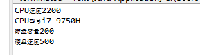

# java
实验二
## 实验目的
 模拟计算机中的cpu的速度和硬盘的容量。
 ## 实验过程
 应用java四个应用程序，PC,CPU,HardDisk和Test
 ## 核心方法
 ```
	public static void main(String args[]) {
	  //创建一个CPU对象
		CPU cpu =new CPU();
	  //将cpu的speed设置为2200
	    cpu.setSpeed(2200);
	  //cpu型号  
	    cpu.settype("i7-9750H");
	  //创建一个HardDisk对象
	    HardDisk disk=new HardDisk();
	  //将disk的amount设置为200
	    disk.setAmount(200);
	  //硬盘读写速度  
	    disk.setspeed2(500);
	  //创建一个PC对象
	    PC pc=new PC();
	    pc.setCPU(cpu);
	    pc.setHardDisk(disk);
	    pc.show();
 ``` 
	   
## 实验结果

## 实验感想
通过此次实验渐渐接触并熟悉运用java，尤其熟悉了类的创建及基本数据类型使用，学会了类的组合与复用
